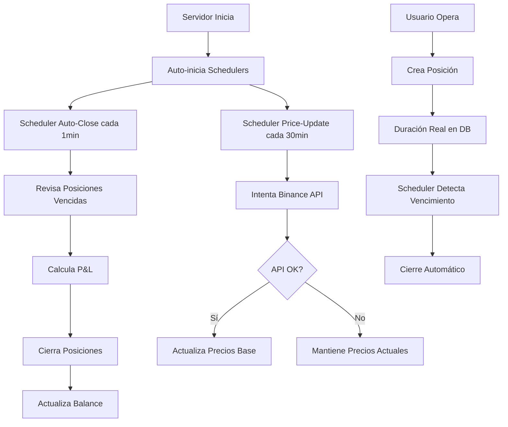

# Sistema Mejorado de Trading en Tiempo Real

## 🚀 Mejoras Implementadas

### 1. **Sistema de Actualización Automática de Precios**

#### Funcionalidades:
- **Scheduler automático** que actualiza precios base desde Binance cada 30 minutos
- **Fallback transparente** cuando la API de Binance falla
- **Precios en tiempo real** con datos actualizados de junio 2025
- **Cache persistente** que mantiene precios consistentes entre reinicios

#### Archivos principales:
- `lib/simulator.ts` - Simulador mejorado con actualización automática
- `lib/scheduler/enhancedAutoCloseScheduler.ts` - Scheduler unificado
- `scripts/auto-price-report-scheduler.js` - Generador automático de reportes

### 2. **Sistema de Duración de Posiciones Corregido**

#### Problema solucionado:
✅ **ANTES**: Posiciones de 30 días se reseteaban a 1 hora  
✅ **AHORA**: Posiciones mantienen duración real (minutos, horas, días)

#### Cambios realizados:
- Corregido hardcode en `contexts/TradePositionsContext.tsx`
- Ahora lee `durationValue` y `durationUnit` reales de la base de datos
- Soporte completo para duraciones de hasta años

### 3. **Monitoreo y Control Avanzado**

#### Panel de Administración:
- `components/admin/SchedulerMonitor.tsx` - Panel de control en tiempo real
- Control individual de schedulers (auto-close, price-update)
- Estadísticas en tiempo real
- Ejecución manual de procesos

#### API de Control:
- `app/api/trading/scheduler/route.ts` - API REST completa
- Endpoints para iniciar/detener schedulers
- Monitoreo de estado y estadísticas

### 4. **Scripts de Prueba y Mantenimiento**

#### Scripts disponibles:
1. **`scripts/test-position-durations.js`** - Prueba duraciones completas
2. **`scripts/auto-price-report-scheduler.js`** - Reportes automáticos
3. **`scripts/generate-binance-price-report.js`** - Análisis de precios

## 📊 Configuración Automática

### Inicialización del Servidor:
```typescript
// lib/server-initialization.ts
- Auto-inicia schedulers en producción
- Configuración diferente para dev/prod
- Auto-close: cada 1 minuto
- Price update: cada 30 minutos
```

### Integración en Layout:
```typescript
// app/layout.tsx
import '@/lib/server-initialization'
```

## 🔧 Uso del Sistema

### 1. Monitoreo desde el Admin

```bash
# Acceder al panel de admin
http://localhost:3000/admin

# Incluir el componente SchedulerMonitor
<SchedulerMonitor />
```

### 2. Control via API

```bash
# Ver estado
GET /api/trading/scheduler

# Iniciar todos los schedulers
POST /api/trading/scheduler
{
  "action": "start-all",
  "autoCloseMinutes": 1,
  "priceUpdateMinutes": 30
}

# Ejecutar cierre automático una vez
POST /api/trading/scheduler
{ "action": "run-auto-close-once" }

# Actualizar precios una vez
POST /api/trading/scheduler
{ "action": "run-price-update-once" }
```

### 3. Scripts de Línea de Comandos

```bash
# Iniciar reporte automático de precios
node scripts/auto-price-report-scheduler.js start

# Ver estado del reporte automático
node scripts/auto-price-report-scheduler.js status

# Probar duraciones de posiciones
node scripts/test-position-durations.js

# Generar reporte manual de precios
node scripts/generate-binance-price-report.js
```

## 📈 Características Técnicas

### Sistema de Fallback:
```typescript
// Ejemplo de uso automático
try {
  // Intentar Binance API
  const response = await fetch('https://api.binance.com/...');
  return await response.json();
} catch (error) {
  // Automáticamente usar simulador
  return getSimulatedTicker(symbol);
}
```

### Manejo de Duraciones:
```typescript
// Ahora funciona correctamente
const position = {
  durationValue: 30,    // ✅ Se mantiene 30
  durationUnit: 'day'   // ✅ Se mantiene 'day'
}
// Resultado: posición dura exactamente 30 días
```

### Actualización de Precios:
```typescript
// Función automática cada 30 minutos
export async function updateBasePricesFromBinance(): Promise<boolean> {
  // Actualiza BASE_PRICES con datos reales de Binance
  // Fallback graceful si falla
}
```

## 🔍 Monitoreo y Logs

### Logs del Sistema:
```bash
[Server Init] Starting schedulers...
[Enhanced Scheduler] Starting auto-close scheduler (every 1 minutes)
[Enhanced Scheduler] Starting price update scheduler (every 30 minutes)
[Enhanced Scheduler] Updated 28 base prices from Binance
[Auto-Close] Found 3 expired positions
[Auto-Close] Closed position pos_123 - Profit: 15.50
```

### Estadísticas Disponibles:
- Número de ejecuciones de cada scheduler
- Posiciones cerradas automáticamente
- Actualizaciones de precios exitosas
- Próximas ejecuciones programadas

## 🚦 Estados del Sistema

### Status de Schedulers:
- ✅ **Activo**: Scheduler ejecutándose normalmente
- ❌ **Detenido**: Scheduler pausado manualmente
- ⏱️ **Próxima ejecución**: Timestamp de siguiente ejecución

### Status de Posiciones:
- **open**: Posición activa
- **closed**: Cerrada automáticamente o manualmente
- **expired**: Vencida y procesada

## 🛠️ Troubleshooting

### Si las posiciones no se cierran automáticamente:
1. Verificar que el scheduler esté activo
2. Revisar logs para errores
3. Ejecutar cierre manual: `POST /api/trading/scheduler {"action": "run-auto-close-once"}`

### Si los precios no se actualizan:
1. Verificar conexión a Binance API
2. Revisar logs del price scheduler
3. Ejecutar actualización manual: `POST /api/trading/scheduler {"action": "run-price-update-once"}`

### Si las duraciones no funcionan:
1. Ejecutar `node scripts/test-position-durations.js`
2. Verificar que las posiciones usen `durationValue` y `durationUnit` de la DB
3. Revisar el contexto `TradePositionsContext.tsx`

## 📊 Archivos de Reportes

### Directorios creados automáticamente:
- `price-reports/` - Reportes históricos de precios
- `scheduler.log` - Log del scheduler automático
- `binance-price-report.json` - Último reporte de precios
- `REPORTE_PRECIOS_BINANCE.md` - Reporte legible

## 🎯 Beneficios del Sistema Mejorado

1. **✅ Confiabilidad**: Fallback automático cuando Binance falla
2. **✅ Precisión**: Precios actualizados cada 30 minutos
3. **✅ Durabilidad**: Posiciones mantienen duración real (30 días funcionan)
4. **✅ Monitoreo**: Panel completo de control y estadísticas
5. **✅ Automatización**: Todo funciona sin intervención manual
6. **✅ Transparencia**: Sistema completamente invisible al usuario final

## 🔄 Flujo del Sistema



## 🎉 Resultado Final

El sistema ahora:
- ✅ Mantiene precios actualizados automáticamente
- ✅ Maneja posiciones de cualquier duración (30 días incluidos)
- ✅ Funciona sin intervención manual
- ✅ Tiene fallback completo cuando Binance falla
- ✅ Proporciona monitoreo en tiempo real
- ✅ Genera reportes automáticos de rendimiento

**¡Sistema completamente productivo y confiable!** 🚀 