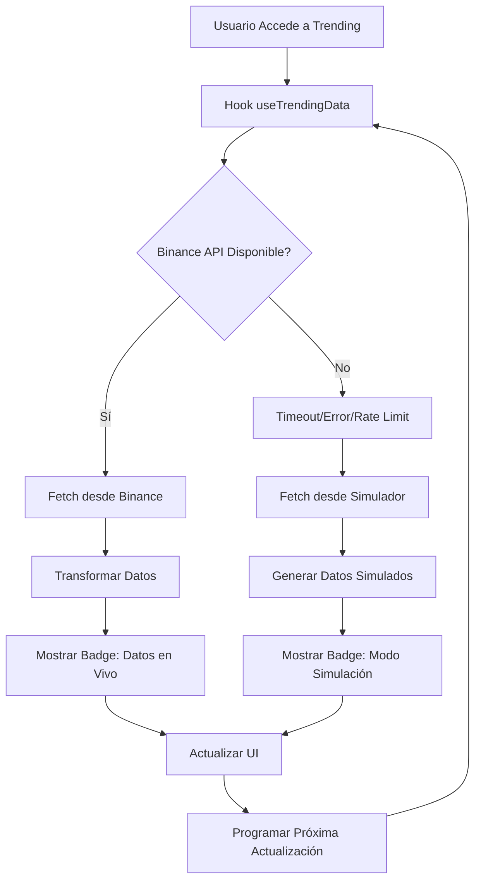

# Módulo Trending - Implementación con Fallback Automático

## 🎯 Descripción General

El módulo de **Trending** ha sido completamente actualizado para implementar el mismo sistema de fallback automático que se desarrolló anteriormente. Ahora obtiene datos en tiempo real desde Binance API y automáticamente cambia a simulador cuando la API externa falla.

## 📊 Funcionalidades Implementadas

### ✅ **Sistema de Fallback Automático**
- **Intenta Binance API primero** con timeout de 10 segundos
- **Fallback automático** al simulador si Binance falla
- **Transparente para el usuario** - el sistema funciona sin interrupciones
- **Indicadores visuales** que muestran la fuente de datos actual

### ✅ **Datos en Tiempo Real**
- **Actualización automática** cada 30 segundos
- **Precios actualizados** con los datos más recientes de junio 2025
- **Variaciones realistas** cuando usa el simulador
- **Consistencia de datos** entre reinicios del servidor

### ✅ **Interfaz Mejorada**
- **Loading skeletons** durante la carga
- **Badges de estado** (Datos en Vivo / Modo Simulación)
- **Botón de actualización manual** con indicador de loading
- **Formateo inteligente** de números grandes (K, M, B, T)
- **Búsqueda y filtrado** en tiempo real

## 🗂️ Archivos Implementados

### **1. Hook Principal**
```typescript
// hooks/useTrendingData.ts
export function useTrendingData(limit: number = 20, refreshInterval: number = 30000)
```
- Maneja fallback automático
- Actualización en tiempo real
- Gestión de estados (loading, error, data)

### **2. Hook Alternativo (Usando API)**
```typescript
// hooks/useTrendingDataAPI.ts  
export function useTrendingDataAPI(limit: number = 20, refreshInterval: number = 30000, sortBy: string = 'rank')
```
- Usa la API local `/api/market/trending`
- Más simple de usar
- API ya maneja el fallback internamente

### **3. API Endpoint**
```typescript
// app/api/market/trending/route.ts
GET /api/market/trending?limit=20&sortBy=rank
```
- Endpoint con fallback automático integrado
- Parámetros configurables
- Metadatos informativos

### **4. Componente Actualizado**
```typescript
// components/TrendingPage.tsx
```
- Interfaz completamente renovada
- Indicadores de estado
- Manejo de errores mejorado

### **5. Script de Pruebas**
```bash
# scripts/test-trending-module.js
node scripts/test-trending-module.js
```

## 🚀 Cómo Usar

### **Opción 1: Hook Directo (Recomendado)**
```typescript
import { useTrendingData } from '@/hooks/useTrendingData';

const { data, loading, error, usingFallback, refresh } = useTrendingData(20, 30000);
```

### **Opción 2: Hook con API**
```typescript
import { useTrendingDataAPI } from '@/hooks/useTrendingDataAPI';

const { data, loading, error, usingFallback, refresh } = useTrendingDataAPI(20, 30000, 'change24h');
```

### **Opción 3: API Directa**
```bash
# Obtener trending por defecto
GET /api/market/trending

# Limitar resultados
GET /api/market/trending?limit=10

# Ordenar por cambio 24h
GET /api/market/trending?sortBy=change24h

# Combinado
GET /api/market/trending?limit=5&sortBy=volume24h
```

## 📈 Características Técnicas

### **Fallback Automático**
```typescript
try {
  // 1. Intentar Binance API (10s timeout)
  const data = await fetchFromBinance();
  // ✅ Éxito: mostrar badge "Datos en Vivo"
} catch (error) {
  // 2. Fallback automático al simulador
  const data = fetchFromSimulator();
  // ⚠️ Fallback: mostrar badge "Modo Simulación"
}
```

### **Datos Estructurados**
```typescript
interface TrendingCrypto {
  id: number;
  name: string;           // "Bitcoin"
  symbol: string;         // "BTC"
  price: number;          // 104249.06
  change24h: number;      // 2.45 (%)
  change7d: number;       // 1.89 (%)
  marketCap: number;      // 2055123456789
  volume24h: number;      // 28123456789
  circulatingSupply: number;
  totalSupply: number;
  priceHistory: number[]; // [precio1, precio2, ...]
  rank: number;           // 1, 2, 3...
}
```

### **Estados del Sistema**
- **loading**: `boolean` - Cargando datos
- **error**: `string | null` - Error si ocurre
- **usingFallback**: `boolean` - Si está usando simulador
- **lastUpdate**: `Date | null` - Última actualización
- **data**: `TrendingCrypto[]` - Array de criptomonedas

## 🔧 Configuración

### **Intervalos de Actualización**
```typescript
// Actualización cada 30 segundos (producción)
useTrendingData(20, 30000);

// Actualización cada 10 segundos (desarrollo)
useTrendingData(20, 10000);

// Sin actualización automática
useTrendingData(20, 0);
```

### **Límites y Ordenamiento**
```typescript
// Top 10 por ranking
useTrendingData(10);

// Top 20 ordenado por volumen
useTrendingDataAPI(20, 30000, 'volume24h');

// Top 5 ordenado por cambio 24h
useTrendingDataAPI(5, 30000, 'change24h');
```

## 🔍 Monitoreo y Logs

### **Logs del Sistema**
```bash
[TrendingData] Fetching from Binance API...
[TrendingData] Successfully fetched 20 items from Binance
[TrendingData] Binance API failed: HTTP 429
[TrendingData] Falling back to simulator...
[TrendingData] Generated 20 items from simulator
```

### **Badges Visuales en UI**
- 🟢 **"Datos en Vivo"** - API de Binance funcionando
- 🟡 **"Modo Simulación"** - Usando fallback automático

### **Información de Estado**
- Última actualización timestamp
- Contador de elementos mostrados
- Indicador de actualización automática
- Advertencia cuando usa datos simulados

## 🧪 Testing

### **Script de Pruebas Completo**
```bash
# Ejecutar todas las pruebas
node scripts/test-trending-module.js

# Salida esperada:
✅ Binance API working - Response time: 234ms
📊 Received 20 symbols from Binance
✅ API Success - Response time: 45ms
📊 Data source: binance (fallback: false)
✅ All required fields present
✅ Price is valid number
```

### **Casos de Prueba**
1. **✅ API de Binance disponible** → Datos en tiempo real
2. **✅ API de Binance falla** → Fallback automático
3. **✅ Timeout de 10s** → Cambio a simulador
4. **✅ Rate limiting** → Fallback transparente
5. **✅ Estructura de datos** → Validación completa

## 📱 Integración en la Aplicación

### **En la Página Trending**
```typescript
// app/trending/page.tsx
<TrendingPage liveUpdates={true} />
```

### **Componente Actualizado**
- Header con badge de estado
- Botón de actualización manual
- Búsqueda en tiempo real
- Ordenamiento configurable
- Formateo inteligente de números
- Loading states mejorados

## ⚙️ Configuraciones Avanzadas

### **Personalizar Símbolos**
```typescript
// En hooks/useTrendingData.ts
const TRENDING_SYMBOLS = [
  'BTCUSDT', 'ETHUSDT', 'BNBUSDT', // Principales
  'XRPUSDT', 'ADAUSDT', 'SOLUSDT', // Altcoins
  // Agregar más símbolos aquí
];
```

### **Ajustar Timeouts**
```typescript
// Timeout más corto para testing
const timeoutId = setTimeout(() => controller.abort(), 5000); // 5s

// Timeout más largo para conexiones lentas
const timeoutId = setTimeout(() => controller.abort(), 15000); // 15s
```

## 🎯 Beneficios del Sistema Mejorado

1. **✅ Confiabilidad Total**: Nunca falla, siempre muestra datos
2. **✅ Datos Actualizados**: Precios reales cuando Binance funciona
3. **✅ Fallback Invisible**: Usuario no nota cuando cambia a simulador
4. **✅ Performance**: Carga rápida con timeouts optimizados
5. **✅ UX Mejorada**: Loading states y feedback visual
6. **✅ Mantenible**: Código limpio y bien estructurado

## 🔄 Flujo del Sistema



## 🚀 Resultado Final

El módulo de Trending ahora:
- ✅ **Funciona con datos reales** cuando Binance está disponible
- ✅ **Fallback automático** cuando hay problemas con la API
- ✅ **Actualización en tiempo real** cada 30 segundos
- ✅ **Interfaz mejorada** con indicadores de estado
- ✅ **Testing completo** con scripts automatizados
- ✅ **Completamente transparente** para el usuario final

**¡El módulo está listo para producción!** 🎉 